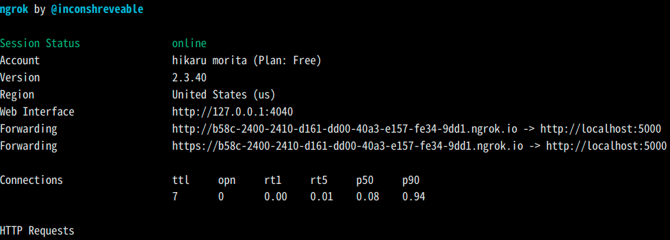
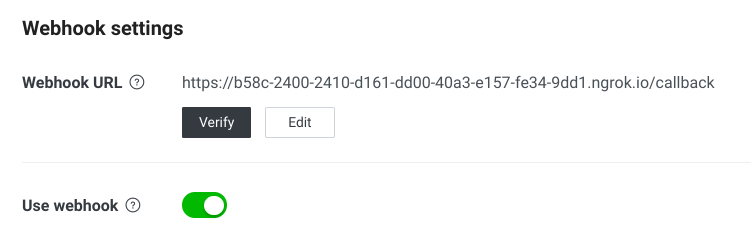

## メモ

### ローカルで LINEdeveloper から webhook する方法
まずサーバーをローカルで起動する
```
flask run
```
次に ngrok で公開する
(flask run のデフォルトが 5000 番ポートなので 5000 を指定)
```
ngrok http 5000
```
結果


上記の https://~.ngrok.io をコピーし、LINE Developers 内 Messaging API 内の webhook URL にペーストし Verify をクリック( Use webhook にチェックを入れる)



### auth 関連の設定ページ
- [line developer](https://developers.line.biz/console/provider/1656608676)
- [ngrok](https://dashboard.ngrok.com/get-started/setup)

### ローカル(ubuntu) での開発での参考元
- [サンプルプログラムが動くまで：qiita](https://qiita.com/suigin/items/0deb9451f45e351acf92)
- [ngrok の使い方：個人ブログ](https://parashuto.com/rriver/tools/secure-tunneling-service-ngrok)

### 参考元
- [川口さんの LINEBOT_資料.pdf](/home/moritta/Downloads/LINEBOT_資料.pdf)
- [奥山の LINEBot](https://github.com/Masaki-Okuyama/Random-number-LINEbot)
- [MessageAPI リファレンス](https://developers.line.biz/ja/reference/messaging-api/)
- [flask ドキュメント](https://msiz07-flask-docs-ja.readthedocs.io/ja/latest/index.html)
<!-- - []() -->
