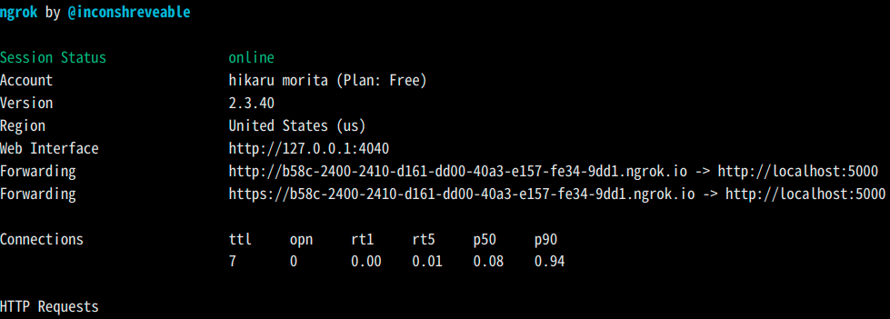

# Linebot 開発用メモ
## 使い方
### ローカルで LINEdeveloper から webhook する方法
まずサーバーをローカルで起動する
```bash
flask run
```
次に ngrok で公開する
(flask run のデフォルトが 5000 番ポートなので 5000 を指定)
```bash
ngrok http 5000
```
結果


上記の https://~.ngrok.io をコピーし、LINE Developers 内 Messaging API 内の webhook URL にペーストし Verify をクリック( Use webhook にチェックを入れる)


この時の注意点は /callback を末尾に付け忘れないようにする
当然だがなにも付け足さない場合は / に POST リクエストが飛んでしまう

### docker の使い方
(まだ flask コンテナができただけ)

カレントディレクトリの Dockerfile からイメージをビルドする
```bash
docker build .
```

次にビルドしたイメージにタグを付ける
```bash
docker tag "image_id" linebot gerosa_linebot_python:1.0
```

タグ名を指定してイメージからコンテナを立ち上げる方法
(flaskが5000番ポートなので5000を指定)
```bash
docker run -i -t -p 5000:5000 gerosa_linebot_python:1.0 /bin/bash
```

ローカルディレクトリを指定しマウントしてコンテナを立ち上げる方法
```bash
docker run -i -t -p 5000:5000 -v /home/moritta/working/gerosa-baseballStatistics-LINEbot:/linebot gerosa_linebot_python:1.0 /bin/bash
```

立ち上がっているコンテナに入る方法は
```bash
docker ps
```
でコンテナIDを確認して exec で入る
(bin/bash はシェルにホストにあるbashを指定している)
```bash
docker exec -it コンテナID bin/bash
```

余談だが使わないイメージをまとめて削除するにはこれ
```bash
docker image prune
```
### データベース設計
db-diagram
https://dbdiagram.io/d/61e7631ebb7a646986fa91c6


## TODO

### 次にやること
- データベースのテーブルをコンテナ起動時に作成する
- Linebot で打者成績、投手成績を受け取る
- 受け取ったデータをデータベースへ
- データベース内のデータを Linebot で取り出す

### 未解決問題

#### port 関連
``` bash
docker-compose up
```
を実行すると一度目は
``` bash
flask_1  |      Is the server running on host "psql" (192.168.224.2) and accepting
flask_1  |      TCP/IP connections on port 5432?
```
のエラーが出るが２回目は動く、なんで？
データベースの生成がなぜか flask の後になっているから？

#### python の import について
未解決、なんで import できないのか分からないキレそう
https://ja.stackoverflow.com/questions/73880/python-import%E5%8B%95%E4%BD%9C


### psql への入り方
``` bash
docker-compose exec psql bash
```
でまずコンテナに入る

次に、 psql コンテナ内で db に入る方法
```bash
psql -U admin
```
admin は docker-compose 内で指定しているユーザー名

データベース内に入るには
```bash
psql -U [データベース名]
```

テーブル一覧は
```bash
\dt
```

- https://uga-box.hatenablog.com/entry/2020/10/14/000000
- https://zenn.dev/dowanna6/articles/6cc31869346a06

## 注意点

### docker コンテナで flask サーバーを運用する場合の注意
コンテナ内でサーバーを立てる場合は**必ず**下記のコマンドで実行する
```bash
python app.py
```
以前使っていた
```bash
flask run
```
だと flask コード内の
```python
app.run('host=0.0.0.0')
```
の引数で指定したものが反映されないので問題が起きる

flask run を使いたいのならオプションで指定する
```bash
flask  run --host=0.0.0.0
```

そもそも host=0.0.0.0 に設定する理由は外部からアクセスするため、
ホストからコンテナ内へのアクセスは外部アクセスなのでデフォルトでは不可能

### docker-entrypoint-initdb.dはデータフォルダにファイルがあると再ロードしない
https://teratail.com/questions/260793

## 雑多メモ
### pip install について
```bash
pip install psycopg2    
```
ができなかったため https://qiita.com/b2bmakers/items/d1b0db5966ac145b0e29 
を参照し
```bash
sudo apt install libpq-dev
```
を実行したところできた

#### psql の init について
なぜか initdb ができていなかった
docker-compose.yml の volumne 指定がおかしかった
- http://ittoo.jugem.jp/?eid=871
``` bash
#  上手くいかない
 ./postgres_data:/var/lib/postgresql/data 

#  OK
  ./postgres_data:/var/lib/postgresql
```

### docker-compose

``` bash
docker-compose up -d

# docker-compose.yml がある階層で
docker-compose up
```


## 参照ページ一覧
#### auth 関連設定の参照ページ
- [line developer](https://developers.line.biz/console/provider/1656608676)
- [ngrok](https://dashboard.ngrok.com/get-started/setup)

#### ローカル(ubuntu) での開発での参考元
- [サンプルプログラムが動くまで：qiita](https://qiita.com/suigin/items/0deb9451f45e351acf92)
- [ngrok の使い方：個人ブログ](https://parashuto.com/rriver/tools/secure-tunneling-service-ngrok)

#### 参考元
- [川口さんの LINEBOT_資料.pdf](/home/moritta/Downloads/LINEBOT_資料.pdf)
- [奥山の LINEBot](https://github.com/Masaki-Okuyama/Random-number-LINEbot)
- [MessageAPI リファレンス](https://developers.line.biz/ja/reference/messaging-api/)
- [flask ドキュメント](https://msiz07-flask-docs-ja.readthedocs.io/ja/latest/index.html)
<!-- - []() -->

#### docker-compose 参照元
- [](https://qiita.com/kiyokiyo_kzsby/items/bea738fa210216c5ea65)

- https://qiita.com/kiyokiyo_kzsby/items/bea738fa210216c5ea65

- [docker-compose 永続化したボリュームごと初期化](https://qiita.com/k-tabuchi/items/178fdacfbaba091fd25b)